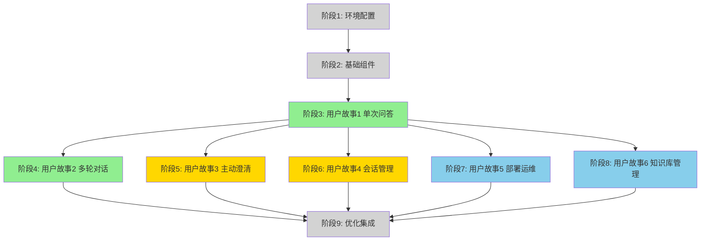

# 任务清单: 魔搭社区智能答疑 Agent 完整集成

**特性**: 002-qa-agent-integration
**分支**: `002-qa-agent-integration`
**创建日期**: 2025-12-01
**状态**: 待实施

---

## 任务概览

| 阶段 | 描述 | 任务数 | 用户故事 | 优先级 |
|------|------|--------|----------|----------|
| 阶段 1 | 环境配置与依赖安装 | 5 | - | 准备 |
| 阶段 2 | 基础组件实现 | 6 | - | 阻塞 |
| 阶段 3 | 用户故事 1 - 单次问答流程 | 13 | US1 | P1 |
| 阶段 4 | 用户故事 2 - 多轮对话 | 12 | US2 | P1 |
| 阶段 5 | 用户故事 3 - 主动澄清 | 8 | US3 | P2 |
| 阶段 6 | 用户故事 4 - 会话管理 | 9 | US4 | P2 |
| 阶段 7 | 用户故事 5 - 部署运维 | 7 | US5 | P3 |
| 阶段 8 | 用户故事 6 - 知识库管理 | 6 | US6 | P3 |
| 阶段 9 | 优化与集成 | 5 | - | 完善 |
| **总计** | | **68** | | |

---

## 实施策略

### 最小可行产品 (MVP)
**推荐首次交付**: **仅用户故事 1** (阶段 1-3)
- 环境配置 + 基础组件 + 单次问答流程
- 总计: 23 个任务
- 交付内容: 完整的端到端单次问答能力
- 独立测试: 可独立验证和演示

### 渐进式交付计划
1. **Sprint 1 (第1周)**: 阶段 1-3 (US1) - MVP 交付
2. **Sprint 2 (第2周)**: 阶段 4 (US2) - 多轮对话能力
3. **Sprint 3 (第2-3周)**: 阶段 5-6 (US3-US4) - 澄清和会话管理
4. **Sprint 4 (第3周)**: 阶段 7-9 (US5-US6 + 优化) - 运维和完善

### 并行执行机会
标记为 `[P]` 的任务可以与前序任务并行执行,条件是:
- 操作不同的文件
- 不依赖未完成任务的输出

---

## 依赖关系图



**图例**:
- 🟢 绿色 (P1): 必须实现 - 核心功能
- 🟡 黄色 (P2): 应该实现 - 增强体验
- 🔵 蓝色 (P3): 可以实现 - 运维管理

**故事依赖关系**:
- **US1** 是所有其他故事的基础 (必须先完成)
- **US2, US3, US4** 可以在 US1 完成后并行开发
- **US5, US6** 可以在 US1 MVP 完成后启动
- 所有故事在 **阶段 9: 优化集成** 汇聚

---

## 阶段 1: 环境配置与依赖安装

**目标**: 初始化项目环境并安装依赖

**任务清单**:

- [x] T001 在 modelscope_qa_agent/requirements.txt 中添加 LangGraph 及相关依赖
- [x] T002 在 modelscope_qa_agent/requirements.txt 中添加 Redis Python 客户端 (redis-py)
- [x] T003 [P] 在 config/config.yaml 中添加 agent 和 session 配置段
- [x] T004 [P] 创建 agents/ 模块目录结构 (agents/__init__.py, agents/state.py, agents/nodes.py, agents/prompts.py)
- [x] T005 [P] 创建 api/routers/ 目录用于模块化路由 (api/routers/__init__.py, api/routers/qa.py, api/routers/session.py, api/routers/admin.py)

**验证方法**:
```bash
# 验证安装
pip list | grep -E "langgraph|redis"
# 验证目录结构
ls -la modelscope_qa_agent/agents/
ls -la modelscope_qa_agent/api/routers/
# 验证配置结构
grep -E "agent:|session:" modelscope_qa_agent/config/config.yaml
```

---

## 阶段 2: 基础组件实现

**目标**: 实现所有用户故事所需的阻塞性前置组件

**任务清单**:

- [x] T006 在 agents/state.py 中实现 AgentState TypedDict 定义
- [x] T007 [P] 在 services/session_manager.py 中实现 SessionManager 类及 Redis CRUD 操作
- [x] T008 [P] 在 services/session_manager.py 中实现 ConversationTurn 数据类
- [x] T009 更新 config_loader.py 以加载 agent 和 session 配置
- [x] T010 [P] 在 agents/prompts.py 中创建基础 Agent 提示词库
- [x] T011 在 api/main.py 的启动事件中添加 Redis 连接初始化

**验证方法**:
```bash
# 测试导入
python3 -c "from agents.state import AgentState; from services.session_manager import SessionManager"
# 测试 Redis 连接
redis-cli ping
# 测试配置加载
python3 -c "from config.config_loader import get_config; config = get_config(); print(config.agent)"
```

**依赖**: 阶段 1 必须完成

---

## 阶段 3: 用户故事 1 - 单次问答流程 (P1)

**故事目标**: 用户通过 Web 界面提出技术问题,系统执行检索、生成答案、展示来源的完整流程

**独立测试标准**:
1. 启动系统 (`./scripts/start.sh`)
2. 访问 http://localhost:8000
3. 输入问题 "如何使用魔搭社区的 Qwen 模型?"
4. 验证返回答案包含: 答案文本、置信度评分、2-3个来源链接
5. 验证响应时间 ≤ 30 秒

**任务清单**:

### 3.1 Agent 核心逻辑 (US1)

- [x] T012 [US1] 在 agents/nodes.py 中实现 question_analysis_node (问题分析节点)
- [x] T013 [US1] 在 agents/nodes.py 中实现 retrieval_node (检索节点,集成 retrieval.hybrid_retrieval)
- [x] T014 [US1] 在 agents/nodes.py 中实现 answer_generation_node (答案生成节点)
- [x] T015 [US1] 在 agents/simple_agent.py 中创建 LangGraph 工作流及 create_agent() 函数

### 3.2 API 实现 (US1)

- [x] T016 [P] [US1] 在 api/routers/qa.py 中实现 POST /api/v2/qa/ask 端点
- [x] T017 [P] [US1] 在 api/main.py 中实现 GET /api/health 健康检查端点
- [x] T018 [P] [US1] 在 agents/nodes.py 的 answer_generation_node 中实现置信度评分逻辑

### 3.3 前端更新 (US1)

- [x] T019 [US1] 更新 api/static/index.html 以展示答案和来源
- [x] T020 [US1] 在 api/static/index.html 中添加加载状态指示器
- [x] T021 [US1] 在 api/static/index.html 中实现置信度评分显示

### 3.4 集成与测试 (US1)

- [x] T022 [US1] 在 tests/test_integration.py 中创建单轮问答集成测试
- [x] T023 [US1] 验证端到端流程: 问题 → 检索 → 答案 → 展示

**依赖**: 阶段 2 必须完成

**并行机会**:
- T016, T017, T018 可并行执行 (不同端点/文件)
- T012-T015 必须顺序执行 (构建 Agent 工作流)
- T019-T021 可与后端任务并行

---

## ，

**故事目标**: 用户与 Agent 进行多轮对话,系统记住对话历史并理解上下文引用

**独立测试标准**:
1. 第一轮: "什么是模型微调?"
2. 第二轮: "有哪些常见的微调方法?"
3. 第三轮: "刚才提到的 LoRA 方法具体怎么用?"
4. 验证第三轮回答正确引用第二轮的 "LoRA"

**任务清单**:

### 4.1 会话管理 (US2)

- [x] T024 [US2] 在 services/session_manager.py 中实现 SessionManager.create_session() 会话创建 ✅
- [x] T025 [US2] 在 services/session_manager.py 中实现 SessionManager.add_turn() 对话历史存储 ✅
- [x] T026 [US2] 在 services/session_manager.py 中实现 SessionManager.get_conversation_history() 对话历史检索 ✅
- [x] T027 [US2] 在 services/session_manager.py 中实现 SessionManager 的会话 TTL 和过期逻辑 ✅

### 4.2 多轮 Agent 逻辑 (US2)

- [x] T028 [US2] 在 agents/state.py 中更新 AgentState 以包含对话历史 ✅
- [x] T029 [US2] 在 agents/nodes.py 中实现超过10轮的上下文摘要逻辑 ✅
- [x] T030 [US2] 在 agents/nodes.py 的 question_analysis_node 中更新以解析上下文引用 ✅

### 4.3 API 与前端 (US2)

- [x] T031 [P] [US2] 在 api/routers/session.py 中实现 POST /api/v2/sessions 端点 (创建会话) ✅
- [x] T032 [P] [US2] 在 api/routers/qa.py 中更新 POST /api/v2/qa/ask 以加载和保存对话历史 ✅
- [ ] T033 [US2] 更新 api/static/index.html 前端以显示多轮对话历史 (可选 - 后端已完成)

**集成测试**:
- [x] T034 [US2] 在 tests/test_multi_turn_api.py 中创建多轮对话测试 ✅

**依赖**: US1 (阶段 3) 必须完成

**并行机会**:
- T024-T027 (SessionManager 方法) 可并行实现
- T031, T032 可并行执行 (不同端点)

---

## 阶段 5: 用户故事 3 - 主动澄清 (P2)

**故事目标**: 当问题信息不足时,Agent 主动提出澄清问题

**独立测试标准**:
1. 输入模糊问题: "模型报错了怎么办?"
2. 验证 Agent 返回澄清问题: "请问您遇到的具体错误信息是什么?使用的是哪个模型?"
3. 用户补充信息后,验证 Agent 给出针对性解决方案

**任务清单**:


### 5.1 澄清逻辑 (US3)

- [x] T035 [US3] 在 agents/nodes.py 的 question_analysis_node 中实现澄清检测逻辑
- [x] T036 [US3] 在 agents/nodes.py 中创建 clarification_generation_node (澄清问题生成节点)
- [x] T037 [US3] 在 agents/prompts.py 中定义澄清提示词模板
- [x] T038 [US3] 在 agents/simple_agent.py 中更新 LangGraph 工作流以包含澄清路径

### 5.2 API 与前端 (US3)

- [x] T039 [P] [US3] 在 api/routers/qa.py 中更新 AgentResponse 模型以包含 is_clarification 字段
- [x] T040 [P] [US3] 在 api/static/index.html 中实现澄清问题显示
- [x] T041 [US3] 在 api/static/index.html 中为澄清消息添加 CSS 样式

**集成测试**:
- [x] T042 [US3] 在 tests/test_clarification_phase5.py 中创建澄清测试场景

**依赖**: US1 (阶段 3) 必须完成

**并行机会**:
- T035-T038 顺序执行 (工作流变更)
- T039, T040, T041 可并行执行

## 阶段 6: 用户故事 4 - 会话管理与多用户支持 (P2)

**故事目标**: 多用户并发使用,会话隔离,支持会话切换和恢复

**独立测试标准**:
1. 用户A 和用户B 同时访问系统
2. 用户A 提问并得到回答
3. 用户B 提问,验证不受用户A 影响
4. 用户A 刷新页面,验证对话历史保留

**任务清单**:

### 6.1 会话管理 API (US4)

- [ ] T043 [P] [US4] 在 api/routers/session.py 中实现 GET /api/v2/sessions 端点 (列出会话)
- [ ] T044 [P] [US4] 在 api/routers/session.py 中实现 GET /api/v2/sessions/{session_id} 端点 (获取会话详情)
- [ ] T045 [P] [US4] 在 api/routers/session.py 中实现 DELETE /api/v2/sessions/{session_id} 端点 (删除会话)

### 6.2 前端会话管理 (US4)

- [ ] T046 [US4] 在 api/static/index.html 中实现页面加载时的会话初始化
- [ ] T047 [US4] 在 api/static/index.html 中添加"新建会话"按钮
- [ ] T048 [US4] 在 api/static/index.html 中实现会话列表侧边栏
- [ ] T049 [US4] 在 api/static/index.html 中实现会话切换逻辑

### 6.3 测试 (US4)

- [ ] T050 [US4] 在 tests/test_concurrent.py 中创建多用户隔离测试
- [ ] T051 [US4] 在 tests/test_integration.py 中创建会话恢复测试

**依赖**: US2 (阶段 4) 必须完成 (需要会话管理基础)

**并行机会**:
- T043, T044, T045 可并行执行 (不同端点)
- T046-T049 顺序执行 (UI 流程)

---

## 阶段 7: 用户故事 5 - 部署运维 (P3)

**故事目标**: 通过脚本一键启动系统,健康检查,查看日志

**独立测试标准**:
1. 在全新环境执行 `./scripts/setup.sh`
2. 执行 `./scripts/start.sh`
3. 访问 http://localhost:8000 验证服务可用
4. 执行 `./scripts/status.sh` 查看所有服务状态

**任务清单**:

### 7.1 部署脚本 (US5)

- [ ] T052 [P] [US5] 创建 scripts/setup.sh 用于环境初始化
- [ ] T053 [P] [US5] 创建 scripts/start.sh 用于一键启动
- [ ] T054 [P] [US5] 创建 scripts/status.sh 用于健康检查
- [ ] T055 [P] [US5] 创建 scripts/docker-compose.yml 用于服务编排

### 7.2 日志与监控 (US5)

- [ ] T056 [US5] 在 agents/qa_agent.py 中实现结构化日志
- [ ] T057 [US5] 在 api/main.py 中实现请求日志中间件

**文档**:
- [ ] T058 [US5] 创建 quickstart.md 包含部署说明

**依赖**: US1 (阶段 3) 必须完成 (基础系统可运行)

**并行机会**:
- T052, T053, T054, T055 全部可并行 (独立脚本)

---

## 阶段 8: 用户故事 6 - 知识库管理 (P3)

**故事目标**: 管理员查看知识库统计,删除文档

**独立测试标准**:
1. 访问管理界面 http://localhost:8000/admin
2. 查看知识库统计(文档数、向量数、存储大小)
3. 删除某个文档,验证向量数据库和MinIO 文件同步删除

**任务清单**:

### 8.1 管理 API (US6)

- [ ] T059 [P] [US6] 在 api/routers/admin.py 中实现 GET /api/v2/admin/knowledge-base/stats 端点 (知识库统计)
- [ ] T060 [P] [US6] 在 api/routers/admin.py 中实现 DELETE /api/v2/admin/knowledge-base/documents/{id} 端点 (删除文档)

### 8.2 管理前端 UI (US6)

- [ ] T061 [US6] 创建 api/static/admin.html 管理仪表板页面
- [ ] T062 [US6] 在 api/static/admin.html 中实现知识库统计展示
- [ ] T063 [US6] 在 api/static/admin.html 中实现文档列表和删除功能

**测试**:
- [ ] T064 [US6] 在 tests/test_integration.py 中创建管理 API 集成测试

**依赖**: US1 (阶段 3) 必须完成

**并行机会**:
- T059, T060 可并行执行
- T061-T063 顺序执行 (UI 构建)

---

## 阶段 9: 优化与集成

**目标**: 最终集成、性能优化和文档完善

**任务清单**:

- [ ] T065 [P] 运行覆盖所有用户故事的端到端系统测试
- [ ] T066 [P] 使用 locust 在 tests/test_concurrent.py 中进行 10 并发用户性能测试
- [ ] T067 [P] 更新 WEB_FRONTEND_GUIDE.md 以包含新功能 (多轮对话、澄清、会话)
- [ ] T068 在 specs/002-qa-agent-integration/contracts/ 中创建完整的 API 文档 (OpenAPI 规范)

**验证检查清单**:
- [ ] spec.md 中的所有 9 个成功标准已验证
- [ ] 所有用户故事可独立测试
- [ ] 文档完整且准确
- [ ] 无严重 bug 或性能问题

**依赖**: 所有之前阶段 (US1-US6) 必须完成

---

## 各故事并行执行示例

### 示例 1: 用户故事 1 (阶段 3)
**顺序执行**:
```bash
# 必须按顺序完成
T012 → T013 → T014 → T015  # Agent 工作流
T015 → T016                 # API 需要 Agent
T023                        # 集成测试最后
```

**并行执行**:
```bash
# 可同时运行
T016 (api/routers/qa.py) || T017 (api/main.py) || T018 (agents/nodes.py)
T019 (HTML) || T020 (HTML) || T021 (HTML)
```

### 示例 2: 用户故事 2 (阶段 4)
**顺序执行**:
```bash
T024 → T025 → T026 → T027  # SessionManager 方法相互构建
T028 → T029 → T030          # Agent 状态更新
```

**并行执行**:
```bash
T031 (api/routers/session.py) || T032 (api/routers/qa.py)
# 两个后端任务完成后:
T033 (前端)
```

### 示例 3: 用户故事 5 (阶段 7)
**全部并行**:
```bash
T052 || T053 || T054 || T055  # 所有脚本独立
```

---

## 任务执行检查清单

实施开始前:
- [ ] 所有阶段 1 (环境配置) 任务完成
- [ ] 所有阶段 2 (基础组件) 任务完成
- [ ] 已审阅 spec.md 用户故事和验收标准
- [ ] 已审阅 plan.md 技术架构
- [ ] 确认 Redis 运行中 (`redis-cli ping`)
- [ ] 确认所有 Feature 001 组件可用

实施过程中:
- [ ] 完成任务后立即标记
- [ ] 为每个完成的任务运行验证测试
- [ ] 在本文档中更新任务状态
- [ ] 每个阶段完成后提交变更

每个用户故事完成后:
- [ ] 运行该故事的独立测试
- [ ] 验证所有验收场景
- [ ] 更新文档
- [ ] 向利益相关者演示 (可选)

---

## 备注

1. **测试策略**: 测试作为独立任务包含 (如 T022, T034, T042) 在每个用户故事阶段末尾
2. **文件路径**: 所有任务指定确切的文件路径以确保清晰
3. **并行化**: 标记 `[P]` 的任务如果操作不同文件可与前序任务并行
4. **故事标签**: `[US1]`, `[US2]` 等将任务映射到用户故事便于跟踪
5. **依赖关系**: 每个阶段明确说明前置条件
6. **独立测试**: 每个用户故事包含独立测试标准便于隔离验证

---

**生成日期**: 2025-12-01
**总任务数**: 68
**预计工作量**: 2-3 周 (基于团队规模和开发速度)
